# NexusOS 初赛文档

## 概述

NexusOS 是一个基于 Rust 的类 Unix 操作系统，是多核、异步、framekernel 架构的 OS。

### 框内核架构简介

https://asterinas.github.io/book/kernel/the-framekernel-architecture.html

**框内核（Framekernel）是一种将“微内核的安全性”与“单体内核的性能”结合的新型操作系统架构**。其核心思想体现在以下几点：  

- **单地址空间**：整个操作系统都运行在同一地址空间中，像单体内核一样可以通过普通函数调用和共享内存实现最快速的内部通信。  

- **Rust 全栈实现，分区管理安全性**：  
  - **OS Framework（操作系统框架）**  
    - 体量小，只允许使用 *unsafe Rust* 处理极少量底层代码。  
    - 其职责是把不安全代码封装为一组 *安全 API*，对内核内存安全负责。  
  - **OS Services（操作系统服务）**  
    - 体量大（系统调用、文件系统、设备驱动等均在此实现），只能用 *safe Rust* 编写。  
- **最小可信基（TCB）**：由于只有 OS Framework 中的代码可使用不安全 Rust，系统整体的内存安全性可以“归约”到这部分极小的 TCB 上，从而显著降低出错面[1]。  

- **四大设计要求**：  
  1. **Soundness（健全性）**：框架提供的安全 API 结合 Rust 工具链应保证使用者无法触发未定义行为。  
  2. **Expressiveness（表达力）**：API 足够丰富，使开发者能在 *safe Rust* 中实现绝大多数 OS 功能，尤其是设备驱动。  
  3. **Minimalism（极简性）**：框架体量越小越好；凡是可在外部实现的功能，不放进框架。  
  4. **Efficiency（高效性）**：API 应为零开销抽象或仅引入极小开销。  


## 进程模型设计

### 0 前瞻

内核异步化的关键点之一是内核控制流的隔离与切换

#### 内核控制流的隔离

同步时，内核控制流是通过多个内核栈以及存储的寄存器值来隔离的。

异步时，内核控制流通过future自动生成的状态机来隔离。

#### 内核控制流的切换

同步时，内核控制流通过切换内核栈和寄存器的值(即`context_switch`函数)来切换。

异步时，内核控制流通过切换状态机来切换。或者是通过`future::poll`函数来切换。

#### 对于实现的影响

同步时，
1. 内核任务需要分配独立的内核栈，
2. 并且需要保存和恢复寄存器的值，即需要task_context字段来保存和恢复寄存器的值

异步时，
1. 内核任务则不需要独立的内核栈，
2. 无需保存和恢复寄存器，不需要task_context字段（对于内核线程与用户线程的切换来说，相应的寄存器数据保存到每个cpu都有的内核栈中即可，不需要单独用task_context字段来保存）
3. 没有显式的任务切换（即没有显式的context_switch函数，而是可能在某一个 await 点切换），且此时一个内核任务对应一个future状态机，所以可以把运行的任务存到相应的future状态机中（通过将要运行的任务作为async 函数的参数或 async 闭包的捕获变量，然后把spawn此future）。


### 1 总体概念

进程/任务子系统负责把**可调度实体**（thread）与**进程语义**（thread‑group）解耦，并借鉴自[umi](https://github.com/js2xxx/umi)，将信息部分（ThreadSharedInfo）与状态部分（ThreadState）分离。其中信息部分对外共享，也就是其他任务均可以访问到；状态部分则对内私有，仅该任务本身可以访问。

* **Task**（任务）是内核异步运行时的最小调度单元，承担 CPU 时间片分配与上下文保存。
* **ThreadGroup** 代表用户态所见的 *process*（进程）；同一组内的各 Task 共享地址空间、文件描述符等资源。
* **ThreadState** 把 Task 与进程相关资源（地址空间、文件表、cwd 等）“绑”在一起，供系统调用与陷入路径快速访问。
* **ThreadSharedInfo + Lifecycle** 记录可被其他线程观测的 TID、父子链、CPU 统计、退出码等持久状态。
* **ProcessVm / UserSpace** 则封装虚拟内存与用户上下文。

### 2 关键数据结构

| 结构                 | 关键字段                                                            | 作用                            |
| ------------------ | --------------------------------------------------------------- | ----------------------------- |
| `Task`             | `data` (跨任务共享只读数据)，`local_data` (仅当前 Task 可写)，`user_space` | 纯调度实体；不直接持有任何内核资源             |
| `CurrentTask`      | 包装 `NonNull<Task>`，并显式 `!Send + !Sync`                          | 保证只在当前执行栈使用本地数据，防止逃逸          |
| `TaskOptions`      | builder 模式，允许一次性注入 `data / local_data / user_space`             | 构建 Task 对象                  |
| `ThreadSharedInfo` | `tid`、`parent/children`、`lifecycle`、`cpu_times`                 | 进程/线程号及可被其他实体观测的公共状态；跨 task 共享，可被父子关系、wait4 等使用          |
| `Lifecycle`        | `state`(原子枚举) + `exit_wait_queue`                               | 线程生命周期状态机（Running/Zombie）和等待队列             |
| `ThreadGroup`      | `id` (= leader tid) + `members`                                 | 线程组容器；实现与 Linux tgid 等价的进程标识  |
| `ThreadState`      | `task`、`thread_group`、`process_vm`、`fd_table`、`cwd`、`user_brk`  | 系统调用路径的**单一入口参数**，屏蔽细节；sys‑call 处理与用户态切换时的工作集      |

下面是这些关键数据结构的具体定义：

```rust
// ostd/src/task/mod.rs

/// A task that executes a function to the end.
///
/// Each task is associated with per-task data and an optional user space.
/// If having a user space, the task can switch to the user space to
/// execute user code. Multiple tasks can share a single user space.
#[derive(Debug)]
pub struct Task {
    data: Box<dyn Any + Send + Sync>,
    local_data: ForceSync<Box<dyn Any + Send>>,
    user_space: Option<Arc<UserSpace>>,
}

/// Options to create or spawn a new task.
pub struct TaskOptions {
    data: Option<Box<dyn Any + Send + Sync>>,
    local_data: Option<Box<dyn Any + Send>>,
    user_space: Option<Arc<UserSpace>>,
}

/// The current task.
///
/// This type is not `Send`, so it cannot outlive the current task.
///
/// This type is also not `Sync`, so it can provide access to the local data of the current task.
#[derive(Debug)]
pub struct CurrentTask(NonNull<Task>);

// kernel/src/thread/state.rs

/// 线程生命周期
pub struct Lifecycle {
    state:           AtomicU8,     // LifeState
    exit_code:       AtomicI32,    // 正常退出码或信号编码
    exit_wait_queue: WaitQueue,    // 供父线程 wait4
}

// kernel/src/thread/thread_group.rs

/// 线程组 —— 等价于 Linux 概念里的 *process*。
pub struct ThreadGroup {
    /// 线程组 id == 组长线程的 tid
    id: u64,
    /// 成员列表
    members: GuardRwArc<Vec<Arc<ThreadSharedInfo>>>,
}

// kernel/src/thread.rs

#[derive(Clone)]
pub struct ThreadSharedInfo {
    tid: u64,
    parent: Weak<ThreadSharedInfo>,
    children: GuardRwArc<Vec<Arc<ThreadSharedInfo>>>,
    lifecycle: Lifecycle,
    /// CPU 时间统计
    pub cpu_times: CpuTimes,
    /// 线程/进程启动时的系统嘀嗒数
    pub start_ticks: u64,
}

pub struct ThreadState {
    pub task: Arc<Task>,
    pub thread_group: Arc<ThreadGroup>,
    pub shared_info: Arc<ThreadSharedInfo>,
    pub process_vm: Arc<ProcessVm>,
    pub fd_table: Arc<FdTable>,
    pub cwd: PathBuf,
    pub user_brk: usize,
}

```

### 3 调度与抢占

* Runtime 结构
  `Core` 持有每核的 `StaticScheduler`，在主循环中不断执行 `tick()`：

  1. 轮询本地 run‑queue。
  2. 若空闲则尝试工作窃取或进入 `wait_for_interrupt()`。

* 抢占控制
  `disable_preempt()` 返回 `DisabledPreemptGuard`；持有期间进入**原子模式**，任何可能睡眠的操作都会触发 panic，防止持锁 context‑switch。

### 4 任务创建流程

1. **构建 Task**

* `ThreadBuilder` 负责拼装 `Task`, `ThreadSharedInfo`, `ThreadGroup` 与 `ProcessVm`。
* `Task::run` 把任务递交给调度器。

```text
ThreadBuilder::spawn()
        ↳ ProcessVm::alloc()                 // 创建地址空间
        ↳ load_elf_to_vm()                   // 映射 ELF
        ↳ TaskOptions::user_space()          // 构建用户空间
        ↳ Arc<Task>::run(ThreadFuture)       // 交 scheduler 调度
```

下面是 `ThreadBuilder::spawn()` 的一个代码示例：
```rust
// kernel/src/thread.rs

pub struct ThreadBuilder<'a> {
    path: Option<&'a str>,
    argv: Option<Vec<CString>>,
    envp: Option<Vec<CString>>,
}

impl<'a> ThreadBuilder<'a> {
    // ...
    pub async fn spawn(&mut self) -> Result<(Arc<ThreadSharedInfo>, JoinHandle<()>)> {
        let process_vm = Arc::new(ProcessVm::alloc().await);
        let path = self.path.take().unwrap();
        let cwd = PathBuf::new(path)?.as_slice().strip_suffix().unwrap_or(PathSlice::from("/")).to_owned_buf();
        let user_task_options = create_user_task(
            &process_vm,
            path,
            self.argv.take().unwrap_or_default(),
            self.envp.take().unwrap_or_default(),
        )
        .await
        .inspect_err(|e| {
            error!("create_user_task 失败: {:?}", e);
        })?;
        info!("创建用户任务完成，准备运行");

        let thread_shared_info = Arc::new(ThreadSharedInfo {
            tid: id::alloc(),
            parent: Weak::new(),
            children: GuardRwArc::new(vec![]),
            lifecycle: Lifecycle::new(),
            cpu_times: CpuTimes::default(),
            start_ticks: ticks_since_boot(),
        });
        let thread_group = ThreadGroup::new_leader(thread_shared_info.clone());
        let thread_local_data = ThreadLocalData {
            process_vm: process_vm.clone(),
        };
        let task = Arc::new(user_task_options.local_data(thread_local_data).build());
        let fd_table = FdTable::with_stdio(0, None, Some(StdIoSource::Serial), None).await?;
        let thread_state = ThreadState {
            task: task.clone(),
            thread_group: thread_group.clone(),
            process_vm: process_vm.clone(),
            shared_info: thread_shared_info.clone(),
            user_brk: 0,
            fd_table,
            cwd,
        };

        let vm_space = process_vm.root_vmar().vm_space().clone();
        let future = task_future(thread_state);
        let join_handle = task.run(ThreadFuture::new(vm_space, future));

        Ok((thread_shared_info, join_handle))
    }
}
```

   *用户态加载 ELF → 生成 `UserSpace` → `TaskOptions::new().user_space(Some(us))` → `build()`*
   创建时若需立即运行，可用 `spawn()` 或 `run()`，两者最终调用调度器注入器：
   `spawn_user_task()` 先把 Future 包装为在中断已开启的环境执行，再交给 maitake 调度器 。

2. **内核运行时**

   * 每 CPU 一个 `StaticScheduler`；全局 `Injector` 做跨核窃取，`yield_now()` 或时钟中断触发抢占。
   * `Core::tick()` 轮询本地队列/定时器→窃取→idle，保证无自旋空转 。


### 5 clone/fork 实现

```text
do_clone()
 ├─ 校验 flag 组合合法性
 ├─ 按 CLONE_THREAD 区分「线程」或「进程」
 │   ├─ 线程: 复用 ThreadGroup / ProcessVm，可选择复用 FD 表
 │   └─ 进程: 深拷贝 VM、创建新 ThreadGroup、复制/共享资源
 └─ 在父 uc 返回 new_tid，在子 uc 强制返回 0
```

下面是 `do_clone` 的一个代码示例：
```rust
// kernel/src/thread/clone.rs

/// clone 入口：由 syscall 调起  
/// 返回父进程视角下的新 tid；子线程/进程在返回点得 0。  
pub async fn do_clone(parent: &mut ThreadState, uc: &mut UserContext) -> Result<ControlFlow<i32, Option<isize>>> {
    let [raw_flags, child_stack, tls, _parent_tidptr, _child_tidptr, _] = uc.syscall_arguments();
    let flags = CloneFlags::from_bits_truncate(raw_flags as u64);

    // 基本合法性校验
    if flags.contains(CloneFlags::CLONE_SIGHAND) && !flags.contains(CloneFlags::CLONE_VM) {
        return_errno_with_message!(Errno::EINVAL, "CLONE_SIGHAND 需要 CLONE_VM");
    }
    if flags.contains(CloneFlags::CLONE_THREAD)
        && !flags.contains(CloneFlags::CLONE_SIGHAND | CloneFlags::CLONE_VM)
    {
        return_errno_with_message!(
            Errno::EINVAL,
            "CLONE_THREAD 需要同时包含 CLONE_SIGHAND | CLONE_VM"
        );
    }

    // 分治逻辑
    let new_tid = if flags.contains(CloneFlags::CLONE_THREAD) {
        clone_thread(parent, uc, flags, child_stack, tls).await?
    } else {
        clone_process(parent, uc, flags, child_stack, tls).await?
    };

    Ok(ControlFlow::Continue(Some(new_tid as isize)))
}
```

系统调用路径 `clone` → `spawn_child()`：

1. 复制/调整 `UserContext`（子返回 0，处理子栈/`tls`）。
2. 为子进程创建独立或共享的 `ProcessVm`（按 `CLONE_VM` 位）。
3. 生成 `ThreadSharedInfo` 并加入父 `children`。
4. 构造 `Task` 并立即调度。


### 6 用户态执行循环

`task_future()` 驱动一个用户任务：

* 使用 `UserMode::execute()` 进入用户态；
* 返回原因可能是 syscall、异常或 kernel event；
* syscall 通过 `syscall()` 分派；页故障交给 `ProcessVm` 处理；
* 当用户态主动 `exit` 或出现不可恢复错误后，调用 `Lifecycle::exit()` 并退出循环。

### 7 退出与回收

* **线程退出**
  `do_exit()` 将 `Lifecycle` 置 Zombie 并广播等待队列；若线程组成员全部 Zombie，则清理其 `Vm`。

* **wait4/等待**
  `do_wait4()` 遍历 `children`，对符合 pid 的子线程调用 `Lifecycle::wait()` 获取退出码，否则挂起当前 Task 在其 WaitQueue 上；支持 `WNOHANG` 非阻塞。

### 8 文件描述符与其他资源

`FdTable` 使用 `RwLock` 与原子引用管理 `FdEntry`；execve 时调用 `clear_cloexec_on_exec()` 处理 `FD_CLOEXEC` 标志。

### 9 关于安全

* 原子模式检查防止持锁睡眠或在中断上下文中调用可能阻塞的 API。
* 所有跨进程资源（地址空间、文件表等）采用 `Arc` + 细粒度锁，引用计数归零时自动回收，避免悬挂指针。

通过 **Task / ThreadState / ThreadGroup** 的分层设计，本内核将调度实体与进程资源彻底解耦；再借助 Lifecycle 原子状态、maitake 运行时与 WaitQueue 原语，实现了兼具 Linux 语义与 Rust 全栈安全保证的进程‑线程子系统。

## VFS 设计

VFS 设计为 RUST 异步文件系统，但由于 Rust 目前对 async 动态分发支持不好，虽可使用 `async-trait` 实现，但性能较差，因此最终采用静态分发。

对于 ext4_fs，目前是使用其同步操作来实现 vfs 的异步操作，是伪异步的，计划后面实现真正的异步。

### 1 整体架构

```
                     +-------------------------+
                     |  Syscall Adapter (fs.rs)|  ← 将 Linux‑style 系统调用映射到 VFS
                     +-----------+-------------+
                                 |
                                 v
            +-------------------------------------------+
            |               VfsManager                 |─── provider 表
            |  (manager.rs)                            |─── mount 表
            +--------------------+----------------------+
                                 |
        +------------------------+-------------------------+
        |                        |                         |
        v                        v                         v
  PathResolver            VnodeCache / DentryCache   Static Dispatch 层
 (path_resolver.rs)         (cache.rs)               (static_dispatch/)
        |                        |                         |
        |                        |                         v
        |                        |                 +----------------------+
        |                        +----------→      |  具体文件系统实现     |
        |                                           |  impls/{ext4_fs,     |
        |                                           |          dev_fs,     |
        |                                           |          memfs, …}  |
        +-------------------------------------------+----------------------+
```

* **Syscall Adapter**
  位于 `kernel/src/syscall/fs.rs`，负责把用户态 open/read/write 等调用翻译为对 `SFileHandle`/`SDirHandle` 的异步操作。

* **VfsManager** – “资源目录”+“挂载点”总管

  * 维护 **ProviderRegistry**（文件系统类型 → provider 实例）
  * 维护 **MountRegistry**（挂载路径 → `MountInfo { id, fs }`）
  * 提供 `mount()/unmount()`、`locate_mount()` 等核心服务
  * 内部使用 ID 池 `IdPool` 发放 `MountId` / `FilesystemId`

* **Static Dispatch**
  为了在 `#![no_std]` 环境中避免 trait object 的动态分发开销，以枚举包裹两种（目前）文件系统实现：`Ext4`、`Dev`。

  * `SVnode`、`SFileSystem`、`SProvider` 三个总汇类型
  * 每个具体能力（文件、目录、符号链接）再细分 `SFile`、`SDir`、`SSymlink` 等枚举

* **缓存**

  * `VnodeCache`：`<VnodeId, SVnode>`，容量可配置，当前仅插入不淘汰
  * `DentryCache`：`<(PathBuf, name), SVnode>`，在 PathResolver 中使用

* **路径子系统**
  零依赖 POSIX‑style 规范化与切片：`PathBuf`/`PathSlice` (path/{buf.rs, slice.rs})
  支持 `.`、`..`、去重 `/` 等逻辑；`PathResolver` 负责跨挂载遍历与符号链接解析。

### 2 核心抽象（traits.rs）

| Trait                  | 关键方法                                            | 备注                   |
| ---------------------- | ----------------------------------------------- | -------------------- |
| `AsyncBlockDevice`     | `read_blocks` / `write_blocks` / `flush`        | 面向块设备；DevFS 不依赖它     |
| `FileSystemProvider`   | `mount()`                                       | 把块设备+选项→文件系统实例       |
| `FileSystem`           | `root_vnode()` / `statfs()` / `sync()` 等        | `Arc<Self>` 参与异步生命周期 |
| `Vnode`                | `metadata()` / `set_metadata()` / `cap_type()`  | 最小公共能力               |
| `FileCap` / `DirCap` … | `open()` / `lookup()` / `create()` / `link()` … | 按需实现的“扩展能力”          |

所有异步方法返回 `impl Future<Output = VfsResult<_>> + Send`。

以下是这些核心 Trait 的定义：

```rust
// kernel/comps/vfs/src/traits.rs

/// 块设备
#[async_trait]
pub trait AsyncBlockDevice: Send + Sync + 'static {
    fn device_id(&self) -> u64;
    fn block_size_bytes(&self) -> VfsResult<u32>;
    fn total_blocks(&self) -> VfsResult<u64>;
    async fn read_blocks(&self, start: u64, buf: &mut [u8]) -> VfsResult<()>;
    async fn write_blocks(&self, start: u64, buf: &[u8]) -> VfsResult<()>;
    async fn flush(&self) -> VfsResult<()>;
}

/// 文件系统提供者
pub trait FileSystemProvider: Send + Sync + 'static {
    type FS: FileSystem;

    fn fs_type_name(&self) -> &'static str;

    fn mount(
        &self,
        dev: Option<Arc<dyn AsyncBlockDevice + Send + Sync>>,
        opts: &FsOptions,
        mount_id: MountId,
        fs_id: FilesystemId,
    ) -> impl Future<Output = VfsResult<Arc<Self::FS>>> + Send;
}

/// 文件系统实例
pub trait FileSystem: Send + Sync + 'static {
    type Vnode: Vnode<FS = Self>;

    fn id(&self) -> FilesystemId;
    fn mount_id(&self) -> MountId;
    fn options(&self) -> &FsOptions;

    fn root_vnode(self: Arc<Self>) -> impl Future<Output = VfsResult<Arc<Self::Vnode>>> + Send;
    fn statfs(&self) -> impl Future<Output = VfsResult<FilesystemStats>> + Send;
    fn sync(&self) -> impl Future<Output = VfsResult<()>> + Send;
    fn prepare_unmount(&self) -> impl Future<Output = VfsResult<()>> + Send;
    fn reclaim_vnode(&self, id: VnodeId) -> impl Future<Output = VfsResult<bool>> + Send;
    fn fs_type_name(&self) -> &'static str;
    fn is_readonly(&self) -> bool;
}

/// Vnode —— 最小公共能力
pub trait Vnode: Send + Sync + 'static {
    type FS: FileSystem<Vnode = Self>;

    fn id(&self) -> VnodeId;
    fn filesystem(&self) -> Arc<Self::FS>;

    fn metadata(&self) -> impl Future<Output = VfsResult<VnodeMetadata>> + Send;
    fn set_metadata(&self, ch: VnodeMetadataChanges) -> impl Future<Output = VfsResult<()>> + Send;

    fn cap_type(&self) -> VnodeType;
}

/// 读写文件能力
pub trait FileCap: VnodeCapability {
    /// 打开文件后产生的句柄类型
    type Handle: FileHandle<Vnode = Self>;

    fn open(self: Arc<Self>, flags: FileOpen) -> impl Future<Output = VfsResult<Arc<Self::Handle>>> + Send;
}

/// 目录能力
pub trait DirCap: VnodeCapability {
    type DirHandle: DirHandle<Vnode = Self>;

    fn open_dir(self: Arc<Self>) -> impl Future<Output = VfsResult<Arc<Self::DirHandle>>> + Send;
    fn lookup(&self, name: &OsStr) -> impl Future<Output = VfsResult<Arc<Self>>> + Send;
    fn create(
        &self,
        name: &OsStr,
        kind: VnodeType,
        perm: FileMode,
        rdev: Option<u64>,
    ) -> impl Future<Output = VfsResult<Arc<Self>>> + Send;
}
```

### 3 Path & Resolver

#### 3.1 规范化算法 (`path/normalize.rs`)

单遍扫描实现：

1. 拆分 `/`
2. 过滤空段和 `.`
3. 处理 `..`（相对路径下溢时保留 `".."`）
4. 重新拼接

#### 3.2 PathResolver

此前用递归实现，但由于递归的异步函数无法确定其future的大小，所以返回值需要用Box来包裹，这导致性能较差，因此最终采用迭代实现。

* 外层 `loop`：处理符号链接重启
* 内层 `walk_one_mount()`：

  * 根据最长前缀锁定挂载 → 获取 FS root
  * 逐段遍历目录
  * 命中 DentryCache 后直接返回
  * 碰到符号链接：返回 `Step::Restart(new_abs)` 给外层

最大跟随深度 `max_symlink = 40`。

### 4 缓存

```rust
pub struct VnodeCache {
    cache: RwLock<BTreeMap<VnodeId, SVnode>>,
    capacity: usize,
}

pub struct DentryCache {
    cache: RwLock<BTreeMap<(PathBuf, AllocString), SVnode>>,
    capacity: usize,
}
```

* 读写均为 **async RwLock**；多读单写
* 未实现 LRU，容量超限时直接拒绝插入
* `DentryCache::invalidate_dir()` 提供目录级失效接口

### 5 Static Dispatch

* `SVnode` → 按 **类型** 决定分派 (`File / Dir / Symlink`)
* `SFileSystem` / `SProvider` → 按 **文件系统实现** 分派 (`Ext4 / Dev`)
* 每个分派层都把异步方法“手写”封装（预计后面会写宏来避免手动），每个分派层都实现都会实现其分派类型都有的方法。

### 6 具体文件系统实现

#### 6.1 DevFS (`impls/dev_fs/`)

* 内存中的 **设备文件系统**，挂载点 `/dev`
* 仅支持 **字符设备文件** 与 **目录**
* `AsyncCharDevice` trait：默认 `read()`/`write()` 返回 `ENODEV`
* 通过 `DevFs::register_char_device(name, dev, perm)` 动态创建 `/dev/<name>`
* 已内置 `StdOutDevice` → 将写入转发到 `ostd::early_print!`

#### 6.2 Ext4 (`impls/ext4_fs/`)

* 依赖第三方库 **another_ext4**

#### 6.4 Pipe

* `RingPipe` + `PipeReader` / `PipeWriter`
* 在 `SFileHandle` 中实现其静态分发，这是由于fd表中存储的是 `SFileHandle`。
* 无文件系统挂载；由 `syscall::do_pipe2` 创建为匿名 `SFileHandle`
* 简易 **阻塞读 + 唤醒** 机制：空读时 `WaitCell::wait()`，写端 `wake()`

### 7 同步策略

| 组件               | 锁类型                                        | 说明                        |
| ---------------- | ------------------------------------------ | ------------------------- |
| `VfsManager`     | `RwLock`（provider/mount）+ `Mutex`（ID pool） | 多读少写                      |
| `PathResolver`   | 无锁；仅调用下层 lock                              | -                         |
| `Ext4Fs.inner`   | `Mutex`                                    | 保证 another_ext4 单线程访问    |
| `DevFs.children` | `RwLock`                                   | 多读目录、少写注册                 |
| 缓存               | `RwLock`                                   | 读多写少                      |
| Pipe             | `Mutex<VecDeque>` + `WaitCell`             | ring‑buffer + wait/notify |

所有锁均为 **async 锁** (`ostd::sync::{Mutex,RwLock}`)，可在 `#![no_std]` 下调度器友好地让出 CPU。

### 8 错误体系 (`verror.rs`)

* 内部以 `nexus_error::Error` 为核心错误类型
* 宏族：`vfs_err_unsupported! / vfs_err_invalid_argument! / vfs_err_not_found! …`
* 返回类型统一为 `VfsResult<T> = error_stack::Result<T, KernelError>`
* 每层 attach 语义化上下文，便于错误追踪

### 9 Syscall 接入要点

| Syscall        | 关键路径                                                       |
| -------------- | ---------------------------------------------------------- |
| `openat`       | 解析 flags → PathResolver → `SFile::open` / `SDir::open_dir` |
| `read`/`write` | 通过 `SFileHandle::{read_at, write_at}`；Pipe/DevFS 统一        |
| `getdents64`   | `SDirHandle::read_dir_chunk` → 手动编码 linux_dirent64        |
| `fstat`        | `vnode.metadata()` → 填充 kstat                              |
| `pipe2`        | `RingPipe::new()` → 两端 fd                                  |
| `mount/umount` | 直接调用 `VfsManager::{mount, unmount}`                        |
| `chdir/getcwd` | 维护 per‑thread `cwd: PathBuf`                               |

### 10 后续工作

1. **VnodeCache / DentryCache** – 完整 LRU / 淘汰策略
2. **MemFS**未完成
3. **权限检查** – 目前只在元数据里存放 mode，尚未在运行期强制检查
4. **Direct I/O / Cache一致性** – OpenStatus::DIRECT / Sync 语义待实现
5. **Provider 热插拔** – 现由 init_vfs 静态注册；可考虑 runtime 加载


## 内存管理设计

本项目的内存模型完全沿用[asterinas](https://github.com/asterinas/asterinas)，仅作了很小的关于适配异步化（还未完全适配）和错误处理的修改。更详细的设计可见[](https://deepwiki.com/oscomp/asterinas)，以及asterinas团队发表的相关文章和论文[Kernel Memory Safety: Mission Accomplished](https://asterinas.github.io/2025/06/04/kernel-memory-safety-mission-accomplished.html)、[Asterinas: A Rust-Based Framekernel to Reimagine Linux in the 2020s](https://www.usenix.org/publications/loginonline/asterinas-rust-based-framekernel-reimagine-linux-2020s)、[Framekernel: A Safe and Efficient Kernel Architecture via Rust-based Intra-kernel Privilege Separation](https://dl.acm.org/doi/10.1145/3678015.3680492)。

下面是我对一个之前版本的星绽的内存模型，画的类图，可能不全面、不完全正确，仅供参考，也可以在[mermaidchart](https://www.mermaidchart.com/app/projects/776bcb2b-933e-4d08-bff1-078b0fab4730/diagrams/0525d383-982a-4d34-92fa-5ad423d87ec5/version/v0.1/edit)上看。

```mermaid
classDiagram
    class ProcessVm {
        -root_vmar: Vmar~Full~
        -init_stack: InitStack
        -heap: Heap
    }
    class InitStack {
        -initial_top: Vaddr
        -max_size: usize
        -pos: Arc~AtomicUsize~
    }
    class Heap {
        -base: Vaddr
        -limit: usize
        -current_heap_end: AtomicUsize
    }
    class Vmar~R~ {
        -0: Arc~Vmar_~
        -1: R
    }
    class Vmar_ {
        -inner: RwMutex~VmarInner~
        -base: Vaddr
        -size: usize
        -vm_space: Arc~VmSpace~
    }
    class VmarInner {
        -vm_mappings: IntervalSet~Vaddr, VmMapping~
    }
    class VmMapping {
        -map_size: NonZeroUsize
        -map_to_addr: Vaddr
        -vmo: Option~MappedVmo~
        -is_shared: bool
        -handle_page_faults_around: bool
        -perms: VmPerms
    }
    class MappedVmo {
        -vmo: Vmo
        -range: Range~usize~
    }
    class VmSpace {
        -pt: PageTable~UserMode~
        -page_fault_handler: Option~fn(&VmSpace, &CpuExceptionInfo) -> core::result::Result<(), ()>~
        -activation_lock: RwLock~()~
        -cpus: AtomicCpuSet
    }

    class PageTable~<br>M: PageTableMode, <br>E: PageTableEntryTrait = PageTableEntry, <br>C: PagingConstsTrait = PagingConsts,~ {
        -root: RawPageTableNode~E, C~
        -_phantom: PhantomData~M~

        +fn activate(&self)
        +unsafe fn clear(&self)
        +fn create_user_page_table(&self) -> PageTable<UserMode>
        +fn make_shared_tables(&self, root_index: Range<usize>)
        +unsafe fn protect_flush_tlb(&self, vaddr: &Range<Vaddr>, mut op: impl FnMut(&mut PageProperty)) -> Result<(), PageTableError>
        +fn empty() -> Self
        +unsafe fn first_activate_unchecked(&self)
        +unsafe fn root_paddr(&self) -> Paddr
        +unsafe fn map(&self, vaddr: &Range<Vaddr>, paddr: &Range<Paddr>, prop: PageProperty) -> Result<(), PageTableError>
        +fn query(&self, vaddr: Vaddr) -> Option<(Paddr, PageProperty)>
        +fn cursor_mut(&'a self, va: &Range<Vaddr>) -> Result<CursorMut<'a, M, E, C>, PageTableError>
        +fn cursor(&'a self, va: &Range<Vaddr>) -> Result<Cursor<'a, M, E, C>, PageTableError>
        +unsafe fn shallow_copy(&self) -> Self
    }

    class PageTableMode {
        <<trait>>
        +const VADDR_RANGE: Range<Vaddr>
        +fn covers(r: &Range<Vaddr>) -> bool
    }
    PageTable --|> PageTableMode

    class UserMode {
        +const VADDR_RANGE: Range<Vaddr>
    }
    PageTableMode <|-- UserMode: impl PageTableMode

    class KernelMode {
        +const VADDR_RANGE: Range<Vaddr>
    }
    PageTableMode <|-- KernelMode: impl PageTableMode

    class PageTableEntryTrait {
        <<trait>>
        +fn new_absent() -> Self
        +fn is_present(&self) -> bool
        +fn new_page(paddr: Paddr, level: PagingLevel, prop: PageProperty) -> Self
        +fn new_pt(paddr: Paddr) -> Self
        +fn paddr(&self) -> Paddr
        +fn prop(&self) -> PageProperty
        +fn set_prop(&mut self, prop: PageProperty)
        +fn is_last(&self, level: PagingLevel) -> bool
    }
    PageTable --|> PageTableEntryTrait

    class RawPageTableNode~E, C~ {
        -raw: Paddr
        -level: PagingLevel
        -_phantom: PhantomData<(E, C)>
    }
    class PageTableNode~E, C~ {
        -page: Frame< PageTablePageMeta~E, C~ >
    }
    RawPageTableNode --|> PageTableNode : lock()

    class Vmo~R~ {
        -0: Arc~Vmo_~
        -1: R
    }
    class Vmo_ {
        -pager: Option~Arc~Pager~~
        -flags: VmoFlags
        -pages: Pages
    }
    class Pages {
        <<enumeration>>
        -Nonresizable(Mutex~XArray~UFrame~~, usize)
        -Resizable(Mutex<(XArray~UFrame~, usize)>)
    }
    class UFrame {
        <<type alias>>
        Frame~dyn AnyUFrameMeta~ 
    }
    class Frame~M: AnyFrameMeta + ?Sized~ {
        -ptr: *const MetaSlot
        -_marker: PhantomData~M~
    }
    class AnyFrameMeta {
        <<trait>>
        - fn on_drop(&self)
        - fn is_untyped(&self) -> bool
    }
    AnyFrameMeta <|-- Frame
    class PageTablePageMeta~E, C~ {
        -nr_children: Sync< UnsafeCell~u16~ >
        -level: PagingLevel
        -lock: AtomicU8
        -is_tracked: MapTrackingStatus
        -_phantom: PhantomData~(E, C)~

        +fn new_locked(level: PagingLevel, is_tracked: MapTrackingStatus) -> Self
    }
    PageTablePageMeta --|> AnyFrameMeta: imp
    PageTablePageMeta <|-- PageTableNode
    class MapTrackingStatus {
        <<enumeration>>
        -NotApplicable
        -Untracked
        -Tracked
    }
    MapTrackingStatus <|-- PageTablePageMeta
    class AnyUFrameMeta {
        <<trait>>
    }
    AnyUFrameMeta --|> AnyFrameMeta
    AnyUFrameMeta <|-- UFrame: impl AnyUFrameMeta>
    PageTableNode --|> Frame : page
    class MetaSlot {
        -_storage: UnsafeCell~[u8; FRAME_METADATA_MAX_SIZE]~
        -ref_count: AtomicU32
        -vtable_ptr: UnsafeCell~MaybeUninit~FrameMetaVtablePtr~~
    }
    class Pager {
        <<trait>>
        +commit_page(idx: usize): Result~UFrame~
        +update_page(idx: usize): Result~()~
        +decommit_page(idx: usize): Result~()~
        +commit_overwrite(idx: usize): Result~UFrame~
    }

    ProcessVm -- Vmar : root_vmar
    ProcessVm -- InitStack : init_stack
    ProcessVm -- Heap : heap
    Vmar -- Vmar_ : wraps
    Vmar_ -- VmarInner : inner
    Vmar_ -- VmSpace : vm_space
    VmarInner -- VmMapping : vm_mappings
    VmMapping -- MappedVmo : vmo
    MappedVmo -- Vmo : vmo
    VmSpace -- PageTable : pt
    PageTable -- RawPageTableNode : root
    Vmo -- Vmo_ : wraps
    Vmo_ -- Pages : pages
    Vmo_ -- Pager : pager
    UFrame -- Frame
    Frame -- MetaSlot : ptr
    Pages -- UFrame : contains (Nonresizable)
    Pages -- UFrame : contains (Resizable)
```



### 1 物理内存管理

#### 1.1 帧分配器（`mm/frame/allocator.rs`）

* 底层算法：引入 `buddy_system_allocator::FrameAllocator`，再包装为 `CountingFrameAllocator` 以统计已分配字节数。初始化阶段枚举设备树中 `Usable` 物理区段并逐段加入伙伴系统。


#### 2  元数据系统（MetaSlot）

| 字段            | 作用                  | 备注                                         |
| ------------- | ------------------- | ------------------------------------------ |
| `storage[48]` | 任意类型元数据空间           | 最大 48 B，按 64 B slot 对齐                     |
| `ref_count`   | 引用计数                | `MAX → unused`, `MAX‑1 → unique`, `1…n` 正常 |
| `vtable_ptr`  | `AnyFrameMeta` RTTI | 支持动态派发                                     |
| `in_list`     | 所属链表 ID             | 供 `frame::linked_list` O(1) 查询             |

* **映射关系**

  * `frame_to_meta()` / `meta_to_frame()` 将 **物理地址** 与 **元数据页** 在线性区 `FRAME_METADATA_RANGE` 内一一映射。
* **生命周期保证**

  * 新帧由 `MetaSlot::get_from_unused()` 将 `ref_count` 从 `REF_COUNT_UNUSED` 设为 *0* → 初始化元数据 → 设为 *1*（或 `UNIQUE`）。
  * 最后一个引用释放时 `drop_last_in_place()` 先调用自定义 `on_drop()` 回调，再把 `ref_count` 复位为 `UNUSED` 并归还物理页。
  * 通过 `Acquire / Release` 屏障配合，确保并发线程观测到一致的元数据状态。

* **每页 64 B Slot** (`MetaSlot`) 静态映射到 `FRAME_METADATA_RANGE`；通过简单算术完成 **Paddr ↔ MetaSlot** 互转。
* **引用计数语义**

  * `REF_COUNT_UNUSED = u64::MAX` ‑ 未占用
  * `REF_COUNT_UNIQUE = u64::MAX‑1` ‑ 仅 `UniqueFrame` 拥有
  * 0 ‑ 初始化或析构过程中的临时态
  * 1…`REF_COUNT_MAX` ‑ 正常共享持有
    撤销最后一个引用时调用 `drop_last_in_place()`，随后把帧交回伙伴系统。
* 自定义元数据：利用 `Frame<M>` 的泛型形参 `M` ，并要求 `M: AnyFrameMeta`。例如 slab 使用 `Link<T>` 在元数据里串联空闲链表。


#### 1.3 Frame / Segment 抽象

   * `Frame<M>` 表示单页物理帧，`Segment<M>` 表示一段连续帧；两者都携带范型元数据 `M`，以便高层组件无锁地记录额外状态。
   * 默认分配选项 `FrameAllocOptions` 提供 **按需零填充** 及"成段"分配两类接口，零填充由 `ptr::write_bytes` 在早期内核映射中直接完成。


#### 1.4 未类型化内存（Untyped Memory）

`UFrame` / `USegment` 仅暴露 **按字节拷贝** 的 `read/write` 接口，屏蔽硬件或 DMA 对该区段的异步修改对 Rust 引用语义的破坏。

### 2 虚拟内存与页表

#### 2.1 常量与层级

* `PagingConsts` 指定：`BASE_PAGE_SIZE = 4096`，`NR_LEVELS = 4`，`ADDRESS_WIDTH = 48`，对应 **Sv48**。
* 单页含 512 个 PTE (`NR_ENTRIES_PER_PAGE = 512`)。

#### 2.2 页表项实现（`arch/riscv/mm/mod.rs`）

* **字段**：`VALID | R | W | X | USER | GLOBAL | A | D` 以及 PBMT/IO/NAPOT 扩展位；物理地址放于 `[53:10]`。
* **抽象映射**： `PageTableEntryTrait` 将通用 `PageProperty` ↔ RISC‑V PTE 位互转，方便上层跨架构复用。
* **叶节点判定**：`is_last()` 在 level==1 或 RWX 任意位被置时返回 `true`。

#### 2.3 页表切换

`activate_page_table(root_paddr)` 通过 `satp::set(Sv48, asid=0, ppn)` 激活 L4 根表，随后由 `sfence.vma_all()` 统一生效。

### 3 DMA 与设备访问

#### 3.1 DMA 类型判定

`mm/dma/mod.rs::dma_type()` 根据 `arch::iommu::has_dma_remapping()` 选择

* **Direct** — 设备地址 == 物理地址
* **Iommu** — 通过 `iommu::map/unmap` 建立二级映射。
  默认 RISC‑V 实现暂返回 false，故当前运行时路径为 Direct。

#### 3.2 一致性与流式映射

* `DmaCoherent`：为可并行访问的缓冲区创建恒久映射。若设备 **不具缓存一致性**，则在内核页表内将对应条目的 `CachePolicy` 调整为 `Uncacheable` 并刷新 TLB；释放时再改回 `Writeback`。
* `DmaStream`：面向突发 I/O，提供 `sync(range)` 以显式失效/冲刷缓存。RISC‑V 路径中优先使用 `Zicbom` 指令 `cbo.flush`，无该扩展时退化为全栅栏 `fence rw,rw`。
* **重入保护**：全局 `DMA_MAPPING_SET`（BTreeSet + 自旋锁）防止多次映射同一物理页；映射与解除时成对调用 `check_and_insert_dma_mapping()` / `remove_dma_mapping()`。

### 4 缓存策略与 PBMT

* 默认 `CachePolicy::Writeback`；I/O 区域（含非一致 DMA）可标记 `Uncacheable`。
* RISC‑V 如果实现 `Svpbmt` 扩展，可在 PTE 设置 `PBMT_IO` 位进一步细分一致性模型；当前占位实现以注释说明，留待硬件支持落地。

### 5 关键不变量与安全措施

| 编号      | 不变量 / 保护措施                                       | 触发位置                    |
| ------- | ------------------------------------------------ | ----------------------- |
| Inv‑1   | `Frame`/`Segment` 只能从未使用物理页产生                    | 元数据原子 CAS               |
| Inv‑2   | OSTD 客户端无法直接操作内核态寄存器                             | `UserContext` 仅暴露非特权字段  |
| Inv‑3   | IOMMU 中断重映射打开，阻止伪造 trap                          | `arch::iommu` 初始化       |
| Inv‑4/5 | 内核敏感页不暴露给 USPACE，也不被 DMA 覆盖                      | frame 类型区分 + IOMMU 映射   |
| Inv‑6   | DMA 仅允许映射 Untyped Memory                         | `Dma*::map` 内部断言        |
| Inv‑7   | 仅允许为标记为“insensitive”的 MMIO/PIO 创建 `IoMem/IoPort` | 设备枚举阶段                  

### 6 并发与中断上下文

* 全局结构（伙伴分配器、DMA_MAPPING_SET 等）统一使用 `GuardSpinLock` 并在进入锁前屏蔽本地中断，确保中断上下文不会获取同一锁导致死锁。
* 需要跨 CPU 刷新页表时，`timer::init()` 在 SMP 启动后通过 IPI 触发 `sfence.vma` ，依赖前述锁避免与分配器并发冲突。


### 其他

#### SMP 与异步化改造

1.  **RISC-V 多核启动**：实现了完整的 RISC-V 多核启动流程。这包括修改启动汇编以区分 BSP (引导处理器) 和 AP (应用处理器)、为每个核心设置独立栈空间、通过 SBI 调用唤醒 AP，并确保每个核心都能正确初始化其本地环境。

2.  **异步化内核**：引入了 `maitake` 异步调度器，将内核的任务模型从传统的基于独立内核栈和显式上下文切换的同步模型，转变为基于 `Future` 状态机和调度器轮询的异步模型。
    *   **控制流变革**：内核任务的执行逻辑由 `Future` 状态机隐式管理，取代了原有的独立内核栈和 `context_switch` 机制。
    *   **同步原语调整**：建立了新的同步原语使用策略：对于必须禁用中断/抢占的底层临界区，沿用 `Guard*` 系列锁；对于其他通用场景，则全面采用 `maitake` 提供的异步锁和阻塞锁。

3.  **核间中断 (IPI)**：为了支持多核间的协作，实现了一套源自 x86 的 IPI 机制。该机制采用 per-CPU 的无锁队列来传递带有类型和参数的命令，实现了高效、类型安全的核间通信。

#### 错误处理设计

受[Rust 错误处理在 GreptimeDB 的实践](https://mp.weixin.qq.com/s/PK38PtvAETD7pcHeqeDSTA)启发，设计了一套分层错误处理机制，采用 `error-stack` crate 作为基础，并在编写 VFS 首次使用。

最终的效果类似这样：
```text
could not parse configuration file
├╴at libs/error-stack/src/lib.rs:25:10
├╴could not read file "test.txt"
├╴1 additional opaque attachment
│
╰─▶ No such file or directory (os error 2)
    ├╴at libs/error-stack/src/lib.rs:25:10
    ╰╴backtrace (1)
```

1.  **内部错误丰富化**：在 VFS 等核心组件内部，使用 `error-stack` 来构建错误报告。当错误发生时，`report!` 宏会自动捕获源码位置，并通过 `change_context()` 和 `attach_printable()` 等方法在错误传播链上附加详尽的、结构化的上下文信息。这构成了一个逻辑上的"错误栈"，清晰地展示了错误的根本原因和演变路径。

2.  **统一外部接口**：在 VFS 的公共 API 边界，所有内部的 `error-stack::Report` 都会被转换为统一的 `nexus_error::Error` 类型。这个转换过程会首先使用 `tracing` 记录下完整的内部错误报告（包含所有上下文和附件），然后提取出一个最符合 POSIX 语义的 `Errno` 值暴露给系统调用层。

3.  **轻量化与高效**：此机制避免了生成高开销的系统级 `Backtrace`，仅依赖 `error-stack` 的源码位置捕获和逻辑上下文链，对正常执行路径的性能影响极小。


## 遇到的困难

1.  **物理地址与虚拟地址的混淆**
    *   **问题**：在尝试启动 AP (应用处理器) 时，最初传递给 SBI `hart_start` 调用的是 `_start` 符号的虚拟地址。然而，此时 AP 的 MMU (内存管理单元) 尚未启用或配置，它需要的是物理地址才能正确定位启动代码。这导致 AP 无法启动，且难以调试。
    *   **解决方案**：通过分析 QEMU 的启动日志和链接器脚本，确定内核加载的物理基地址。在调用 `hart_start` 时，显式地将启动符号的虚拟地址转换为物理地址。认识到，在与固件和底层硬件交互时，必须严格区分和管理不同阶段的地址空间。

2.  **隐式的初始化顺序依赖**
    *   **问题**：系统在多核启动后发生 Panic，原因是 `timer` 模块在初始化时需要通过 `smp::inter_processor_call` 发送 IPI 以进行 TLB shootdown，但此时 `smp` 模块自身尚未完成 IPI 中断线的分配 (`INTER_PROCESSOR_CALL_IRQ`)。这是一个典型的隐式初始化顺序依赖问题。
    *   **解决方案**：调整了 `ostd/src/lib.rs` 中的模块初始化顺序，确保 `smp::init()` 在所有可能依赖 IPI 的模块（如 `arch::init_on_bsp()`）之前被调用。这要求必须仔细梳理模块间的依赖关系，并使其显式化。

3.  **AP 启动栈与 BSP 栈溢出**
    *   **问题**：在开发初期，单核启动偶尔会发生异常，表现为 `riscv_boot` 函数被两次调用且传入错误参数。经过排查，最终定位到是 BSP (引导处理器) 的启动栈空间不足（仅 64KiB），在解析设备树或进行早期内存分配时发生了栈溢出，破坏了返回地址。同时，AP 也需要自己独立的、安全的栈空间。
    *   **解决方案**：
        1.  将 BSP 的启动栈空间扩大至 256KiB，解决了栈溢出问题。
        2.  为 AP 设计了独立的启动入口 `_start_ap`。BSP 在唤醒 AP 时，会为其分配独立的栈空间，并将栈顶地址通过 `hart_start` 的 `opaque` 参数（写入 `a1` 寄存器）传递给 AP。AP 从 `_start_ap` 开始执行时，直接从 `a1` 寄存器获取并设置自己的栈指针。

4.  **异步环境下的"当前任务"获取**
    *   **问题**：在切换到 `maitake` 异步模型后，传统的通过全局变量或 TLS (线程局部存储) 来追踪 `current_task` 的方法失效了。因为没有了显式的上下文切换点，无法安全地更新这样一个全局指针。
    *   **解决方案**：对 `maitake` 调度器进行了适度的定制。在 `maitake` 的任务元数据结构中增加了一个 `ostd_task_ptr` 字段。当通过 `Task::run` 创建一个 `maitake` 任务时，将对应的 `Arc<ostd::Task>` 的裸指针存入该字段。之后，在内核的任何地方，都可以通过 `maitake` 提供的 `TaskRef::ostd_task_ptr()` 方法安全地从当前调度器上下文中获取到正在运行的 `ostd::Task` 实例。

5.  **类型化的 IPI 通信与队列管理**
    *   **问题**：最初的 IPI 只能发送一个不带参数的信号，无法满足 TLB shootdown 等需要传递地址范围的复杂场景。转而设计了基于 per-CPU 无锁队列的类型化 IPI 命令机制，但这引入了新问题：如果目标核心处理缓慢，导致其命令队列已满，发送方该如何处理？
    *   **解决方案**：最初的实现是在发送方采用 `spin_loop` 自旋等待，但这在高并发下会浪费 CPU 并可能导致系统不稳定。意识到这是一个需要审慎处理的设计点。当前的方案是保留这个机制，但明确这是一个待优化的风险点。未来的改进方向包括：为 `push` 操作设计超时和重试机制，或者在队列满时返回错误，让调用者决定如何处理（例如，推迟操作或向上传播错误）。

6.  **页表相关**
    *   启动页表映射冲突："boot.S" 里早期设置的启动页表，和后面代码里操作启动页表的地址搞混了，导致起不来。
    *   S 模式访问 U 位页表项限制：ostd 创建页表时会默认给加上 User 位（U 位）。但在 RISC-V 的 S 模式下，CPU 不让访问 U 位是 1 的页表项映射的内存，结果内核访问内存时就出错了。
    *   非叶子页表项 U 位保留问题：为了解决上⾯那个问题，给用户空间映射设置了 U 位，但又有新的问题。RISC-V 手册规定，非叶子页表项（就是目录项）的 U、D、A 位是保留的，软件得把它们清零。我在中间层页表设置了 U 位，导致访问异常。